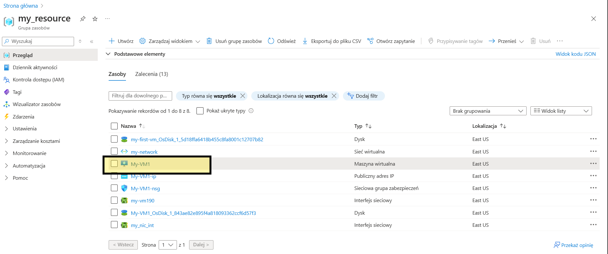
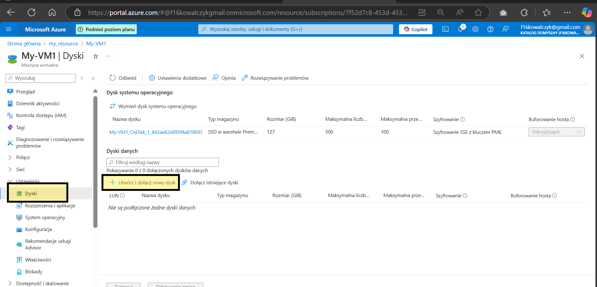
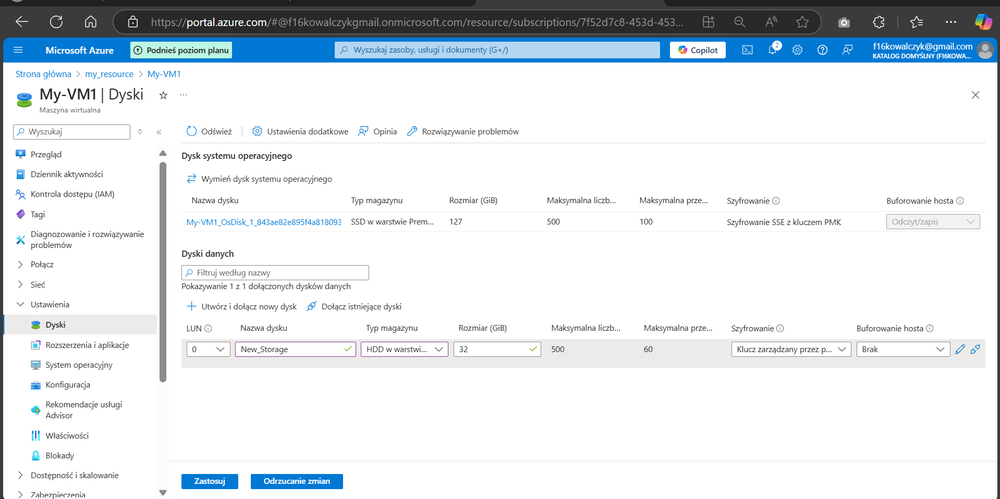
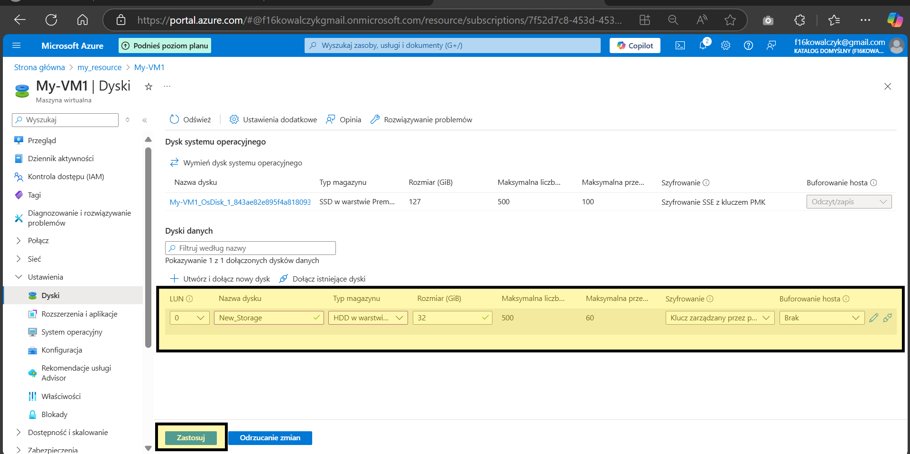
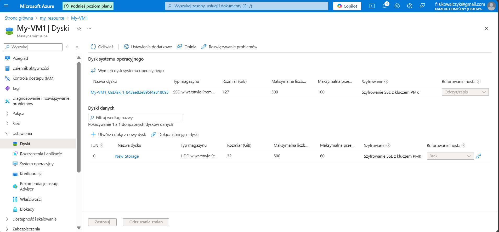

# AZ_Storage
 How to add storage

If you need add storage to VM go to resource nest go to your VM

Nest add storage

create the name in that exampel we add Hdd

Now we have got create storage

# AZ_Storage - resize

